# Human-Archive

Egocentric hand-tracking annotation platform with difficulty-aware frame classification.

## Architecture Diagram

```mermaid
sequenceDiagram
    autonumber

    participant S3 as S3 Bucket<br/>Source MP4s
    participant Pipeline as Pipeline (Go)<br/>download + invoke + upload
    participant Classifier as Classifier (Python)<br/>sample + detect + classify
    participant FS as Filesystem<br/>output/ frames + report.json
    participant Backend as Backend API (Go)<br/>chi/v5 + pgx
    participant DB as PostgreSQL<br/>users/videos/frames/<br/>assignments/annotations
    participant Frontend as Frontend (React/TS)<br/>Cloudflare Workers
    participant User as Annotator / Admin

    rect rgb(40, 50, 70)
        Note over S3,FS: INGEST PIPELINE
        Pipeline->>+S3: download raw .mp4
        S3-->>-Pipeline: video file
        Pipeline->>+Classifier: uv run classify-video
        Classifier->>Classifier: HybridSampler (two-pass scan)
        Classifier->>Classifier: DisagreementEnsemble (MediaPipe)
        Classifier->>Classifier: FrameClassifier (presence + difficulty)
        Classifier-->>-FS: JPEGs + report.json
        Pipeline->>Pipeline: (optional) upload frames to S3
    end

    rect rgb(50, 60, 50)
        Note over Backend,DB: DATA INGESTION
        Frontend->>+Backend: POST /admin/ingest
        Backend->>Backend: parse report.json
        Backend->>+DB: INSERT videos + frames
        DB-->>-Backend: OK
        Backend-->>-Frontend: ingest complete
    end

    rect rgb(60, 50, 50)
        Note over Frontend,User: ASSIGNMENT & ANNOTATION
        Admin->>+Frontend: assign frames to annotator
        Frontend->>+Backend: POST /admin/assignments
        Backend->>+DB: INSERT assignments
        DB-->>-Backend: OK
        Backend-->>-Frontend: assigned
        Frontend-->>-Admin: done
        Annotator->>+Frontend: /dashboard → /annotate/:id
        Frontend->>+Backend: GET /queue
        Backend->>+DB: query pending assignments
        DB-->>-Backend: frames + metadata
        Backend-->>-Frontend: queue items
        Frontend->>Annotator: show frame on canvas
        Annotator->>Frontend: draw bounding boxes → submit
        Frontend->>+Backend: POST /queue/:id/submit
        Backend->>+DB: INSERT annotation
        DB-->>-Backend: OK
        Backend-->>-Frontend: submitted
        Frontend-->>Annotator: next frame
    end

    rect rgb(50, 50, 60)
        Note over Frontend,User: REVIEW
        Admin->>+Frontend: /admin/reviews
        Frontend->>+Backend: GET /admin/reviews
        Backend->>+DB: query annotations for review
        DB-->>-Backend: annotations + frames
        Backend-->>-Frontend: review list
        Admin->>Frontend: approve / reject / correct
        Frontend->>+Backend: POST /admin/reviews/:id
        Backend->>+DB: update annotation status
        DB-->>-Backend: OK
        Backend-->>-Frontend: done
        Frontend-->>Admin: confirmed
    end
```


| Layer | Language | Role |
|---|---|---|
| **Pipeline** | Go | S3 download → subprocess classifier → upload |
| **Classifier** | Python (uv) | Hybrid sampling → MediaPipe ensemble → temporal classification |
| **Backend** | Go | HTTP API, PostgreSQL, JWT auth, annotation CRUD |
| **Frontend** | React/TS | Annotation editor (canvas), admin dashboard |
| **Infra** | Terraform | AWS EC2, Docker, security groups |

## Model Architecture
lassify first-person video frames into 5 categories — `no_hands`, `low_lighting`, `occluded`, `dexterous_pose`, `easy`.

**Approach 1 (Naive baseline)**: Started simple: uniform 2fps sampling + single MediaPipe detector in IMAGE mode. Got 70% `no_hands`, 20% `dexterous`, 10% `easy` — but zero occlusion or low-lighting detection. Clear failure: occlusion, lighting, and complex poses were invisible.  
Insight: MediaPipe's BlazePalm fails entirely under occlusion (no partial landmarks), so a single frame can't distinguish `no_hands` from `occluded`.

**Approach 2 (Ensemble + motion sampling)**: Switched to VIDEO mode for temporal tracking, added a **dual-threshold ensemble** (primary at 0.5 confidence, secondary at 0.15) and a **hybrid sampler** — uniform base rate + event-driven bursts on motion/skin-presence spikes. Occlusion finally appeared at 3.6%, but still way too low   

**Approach 3 (Image quality gates)**: Added CLAHE enhancement for dark frames, blur scoring via Laplacian variance, a dark-first classification priority. Low-light jumped to 30.8%. But occlusion still only 10% — the fundamental problem remained   

**Approach 4 (Temporal bridging — the breakthrough)**: Realized the only way to separate occlusion from no-hands is **temporal context**. Added a **two-pass pipeline**: Pass 1 detects everything and caches results. Pass 2 computes `nearest_conf_dt` — seconds to the nearest confident neighbor detection — and uses bidirectional bridging (0.7s window). If a confident detection exists nearby, a frame without hands is `occluded`, not `no_hands`. This tripled occlusion detection to 25.6%

```mermaid
sequenceDiagram
    autonumber

    participant Video as MP4 Video<br/>S3 / Local
    participant Sampler as HybridSampler<br/>Pass 1: Coarse Scan
    participant Events as Event Detector<br/>_detect_events()
    participant Plan as Pass 2: Sample Plan<br/>uniform + event bursts
    participant Ensemble as DisagreementEnsemble<br/>Primary 0.5 / Secondary 0.15
    participant Feats as Feature Extractor<br/>image_stats + hand_features
    participant Cache as Frame Cache<br/>_Record[] (JPEG + signals)
    participant Tracker as Bidirectional Tracker<br/>_track_support()
    participant Classifier as FrameClassifier<br/>Stage 1: Presence<br/>Stage 2: Difficulty
    participant Output as Output Writer<br/>JPEG dirs + report.json

    rect rgb(30, 50, 70)
        Note over Video,Plan: PHASE 1: HYBRID SAMPLING (two-pass)
        Video->>+Sampler: scan(video_path)
        Sampler->>Sampler: Read at ~1 fps, resize to 160×90
        Sampler->>Sampler: Compute brightness, motion (frame diff),<br/>skin mask (HSV+YCrCb)
        Sampler-->>-Events: ScanRow[] (presence, brightness, motion)
        Events->>Events: Detect presence cross, brightness drop,<br/>motion spike → timestamped events
        Events-->>Plan: events: (hand_event | confidence_drop, ts)
        Plan->>Plan: Uniform 1 fps across whole clip
        Plan->>Plan: Event bursts at 5 fps (±3s window)<br/>Confidence drops at 10 fps
        Plan->>Plan: Dedup by frame index,<br/>priority: confidence_drop > hand_event > transition > uniform
        Plan->>Plan: Cap to max_frames, thin uniform if over budget
        Plan-->>Feats: Sample[] (frame_index, timestamp, reason, rate)
    end

    rect rgb(40, 60, 80)
        Note over Ensemble,Cache: PHASE 2: DETECTION PASS (per planned frame)
        Feats->>Feats: Compute ImageStats<br/>(mean_lum, p10_lum, contrast, blur, hist_spread)
        alt mean_luminance < 0.32
            Feats->>Feats: CLAHE on LAB L-channel<br/>brighten shadows without blowing highlights
        end
        Feats->>+Ensemble: detect(frame, timestamp_ms)
        Ensemble->>Ensemble: Primary HandDetector (conf=0.5)<br/>Secondary HandDetector (conf=0.15)
        Ensemble->>Ensemble: Both run MediaPipe HandLandmarker<br/>(BlazePalm + 21-keypoint model)
        Ensemble-->>-Feats: r_primary, r_secondary, disagreement, n1, n2
        Feats->>Feats: Merge hands: keep primary,<br/>add secondary if IoU < 0.3 with primary
        Feats->>Feats: Extract HandFeatures per hand<br/>(bbox, handedness, articulation,<br/>finger_spread, out_of_frame, border_clipping)
        Feats->>Feats: Compute local_strength<br/>(0.6×confidence + 0.25×completeness + 0.15×size)<br/>×0.5 if secondary-only detection
        Feats->>Feats: Encode JPEG
        Feats-->>Cache: _Record (sample, feats, local_strength,<br/>disagreement, n_primary, n_secondary,<br/>best_box, jpeg, used_clahe)
    end

    rect rgb(50, 70, 50)
        Note over Tracker,Classifier: PHASE 3: CLASSIFICATION PASS (bidirectional temporal)
        Tracker->>Tracker: For each _Record at index i:
        Tracker->>Tracker: Scan neighbours backward + forward<br/>within ±temporal_window_s (2.0s)
        Tracker->>Tracker: Compute track_support = max neighbour local_strength
        Tracker->>Tracker: Compute nearest_conf_dt = seconds to<br/>nearest neighbour with strength ≥ track_strong (0.55)
        Tracker-->>Classifier: (track_support, nearest_conf_dt)
        Classifier->>Classifier: Compute jitter = 1 - mean(IoU with adjacent frame boxes)
        Classifier->>Classifier: Compute scores:<br/>s_low = f(mean_lum, p10_lum, contrast)<br/>s_occ = f(partial_loss, border_clip, blur, low_conf, disagreement)<br/>s_dex = f(articulation, finger_spread, self_overlap, jitter)
        Note over Classifier: Stage 1: PRESENCE DECISION
        Classifier->>Classifier: local_present = local_strength ≥ 0.50
        Classifier->>Classifier: short_gap = nearest_conf_dt ≤ 0.7s
        Classifier->>Classifier: hinted_gap = has_hint AND nearest_conf_dt ≤ 1.4s
        alt local_present
            Classifier->>Classifier: present=true, lost=false
        else short_gap or hinted_gap
            Classifier->>Classifier: present=true, lost=true<br/>╴ temporal bridge: dropout inside live track
        else
            Classifier->>Classifier: present=false, lost=false
        end
        Note over Classifier: Stage 2: DIFFICULTY ATTRIBUTION
        alt not present
            Classifier->>Classifier: → no_hands
        else s_low ≥ 0.35
            Classifier->>Classifier: → low_lighting
        else lost (temporal dropout, not dark)
            Classifier->>Classifier: → occluded
        else s_dex ≥ 0.30 AND s_dex ≥ s_occ
            Classifier->>Classifier: → dexterous_pose
        else s_occ ≥ 0.30
            Classifier->>Classifier: → occluded
        else strict_gates_pass (handedness≥0.7, blur≤0.25,<br/>complete landmarks, scores below thresholds)
            Classifier->>Classifier: → easy
        else fallback to nearest hard class
            Classifier->>Classifier: → occluded or dexterous_pose
        end
        Classifier-->>Output: FrameResult (label, scores, hand_evidence,<br/>features dict with all signals)
    end

    rect rgb(70, 50, 50)
        Note over Output: PHASE 4: OUTPUT
        Output->>Output: Write JPEG to output/<stem>/frames/<label>/*.jpg
        Output->>Output: Accumulate label_counts, reason_counts
        Output->>Output: Return VideoStats
        Note over Output: Outputs report.json with<br/>per-frame features + scores<br/>for ingestion into backend DB
    end
```


## Napkin Math(why not)
Assuming we're only using AWS    
2000 annotators × 500 frames/day = 1M annotations/day

Each frame comes from a 5-min 4K 120fps(worst case) video, sampled at 2fps → 600 frames out. Classifier kills the easy/no_hands ones (~40%), so ~360 frames per video need a human. That means ~2,778 videos must be processed every day to feed the annotators. That's 278 hours of footage daily   

**Pipeline**: MediaPipe hand landmarker is the bottleneck. One frame takes ~80ms on CPU, ~30ms on GPU (T4). For 600 frames per video:
- CPU path: 600 × 80ms = 48s of detection + overhead → ~4 min per video → 185 hours of compute per day
- GPU path (g4dn.xlarge, $0.526/hr): 600 × 30ms = 18s detection → ~1 min per video → 46 hours/day

That's $726/mo on GPU vs $1,888/mo on CPU. GPU is 2.6× cheaper. And if we don't mind interruptions, spot GPU is $0.158/hr → $218/month

**S3**: Every day we need to store 4.2 TB of new raw video (1.5 GB × 2,778) and 1.4 TB of frame JPEGs (600 × 800 KB × 2,778). With a 30-day retention(might be wrong) for raw and 60 days for frames, we're holding ~ 200 TB. S3 Standard is $0.023/GB, so that'd be ~ $4,700/mo. But we don't need hot storage for everything — move raw to IA after a day and frames to IA after 30 days. That drops us to ~ $3,200/mo. Toss in PUT/GET request costs (~$260) and we land at ~$3,460/month for storage

**Egress**: Clients pull 500 GB/day → 15 TB/month. Serving from CloudFront instead of direct S3 saves the S3 egress fee (S3→CloudFront is free). CloudFront charges $0.085/GB for the first 10 TB and $0.08 for the next 5 TB: that's ~$870 + ~$328 = ~$1,200/mo after the 1 TB free tier. Plus $20 for HTTPS requests

**RDS**: 77 GB of DB day one, growing ~ 77 GB/mo — that's a lot of frame metadata and annotations. A db.r6g.large (2 vCPU, 16 GB RAM) can handle it. Multi-AZ for production doubles the compute to $350/mo. Add 500 GB gp3 storage at $58/mo and backup at $7/mo: **~$415/mo**

**Backend API**: A c6i.2xlarge ($248/mo) behind an ALB ($50/mo) handles 2,000 concurrent annotators hitting the API. Plus EBS: **~$313/mo**

**Bottom line**
| Line item | Per month |
| --- | --- |
| Pipeline (GPU on-demand) | $730 |
| S3 (raw + frames, mixed hot/IA) | $3,460 |
| CloudFront egress (15 TB) | $1,220 |
| RDS (r6g.large Multi-AZ) | $415 |
| Backend (c6i.2xlarge + ALB) | $313 |
| **Total** | **~$6,100** |

That's **~$73K/year** at sticker price

Three levers pull the most weight:
- Spot GPU for pipeline (g4dn.xlarge spot): $730 → $218/mo. Saves ~$500
- Lifecycle raw → Deep Archive after 7 days, keep frames in IA: S3 drops from $3,460 → ~$2,200/mo. Saves ~$1,300
- 3-year RDS reserved: $415 → ~$255/mo. Saves ~$160

That gets us to ~$4,000/mo. The big numbers to watch: S3 dominates at 56% of the bill (we're storing a lot of video), egress is 20%, and surprisingly pipeline compute is only 12%. Storage lifecycle policies are our most powerful lever, not instance right-sizing

## Setup

1. Clone and prepare the environment
```bash
git clone https://github.com/MdSadiqMd/Human-Archive.git
cd Human-Archive
```

2. Classifier (Python)
```bash
cd classifier
uv sync
# Verify: should print help
uv run classify-video --help
```

3. Pipeline (Go)
```bash
cd pipeline
go build -o bin/pipeline ./cmd/pipeline
```

4. Backend (Go)
```bash
cd backend
cp .env.example .env   # edit secrets
go build -o backend ./cmd/main.go
```

5. Frontend (React/TypeScript on Cloudflare Workers)
```bash
cd client
pnpm install
# Edit .env.example -> .env with VITE_API_URL pointing to your backend
pnpm dev               # dev server at port 3000
pnpm build             # production build
pnpm run deploy        # deploy to Cloudflare Workers
```

6. Local dev environment (Docker)
```bash
# Start PostgreSQL + backend
docker compose up -d --build

# Run the classifier pipeline on a local video
just classify path/to/video.mp4

# Ingest results into backend
just ingest
```

## Deployment

### Option A: AWS via Terraform (recommended)

The project includes Terraform config that provisions an EC2 instance, installs Docker, clones the repo, and starts all services.

1. Set up variables:
   ```bash
   cp infra/terraform.tfvars.example infra/terraform.tfvars
   # Edit infra/terraform.tfvars:
   #   - key_name: your EC2 key pair name
   #   - postgres_password: strong DB password
   #   - jwt_secret: 64+ char random string (openssl rand -hex 32)
   #   - admin_password: admin user password
   #   - s3_bucket: your S3 bucket for frames
   #   - s3_access_key / s3_secret_key: AWS credentials
   ```

2. Deploy:
   ```bash
   just deploy
   ```
   This runs `terraform apply`, which creates an EC2 t3.medium instance with Ubuntu 22.04. The [`user-data.sh`](infra/user-data.sh) script automatically:
   - Installs Docker, Docker Compose, and git
   - Clones the repo to `/opt/human-archive`
   - Creates `.env` from Terraform variables
   - Starts services via `docker compose -f docker-compose.prod.yml up -d --build`

3. Deploy frontend:
   ```bash
   cd client
   VITE_API_URL=http://<ec2-public-ip>:8080 pnpm run deploy
   ```

4. Post-deployment commands:
   ```bash
   just deploy-info   # show API URL, public IP, SSH command
   just ssh           # SSH into the EC2 instance
   just prod-logs     # tail production logs
   just redeploy      # git pull + rebuild on server
   just destroy       # tear down all AWS resources
   ```

### Option B: Manual Docker deployment (any Linux server)

Run this on a fresh Ubuntu/Debian server:

```bash
sudo ./scripts/deploy.sh
```

This script installs Docker, sets up `/opt/human-archive`, and prompts for a `.env` file before starting services.

### Option C: Local Docker Compose (dev/staging)

```bash
# Create .env from example
cp .env.production.example .env
# Edit .env with your secrets

# Start services
docker compose -f docker-compose.prod.yml up -d --build
```

For the pipeline service (one-shot video processing):

```bash
docker compose -f docker-compose.prod.yml --profile pipeline run pipeline
```
